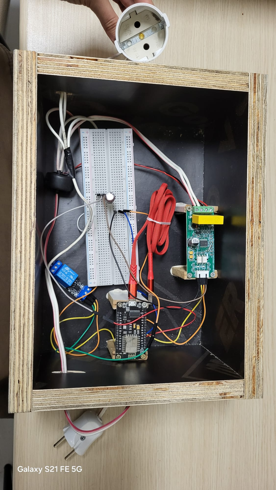
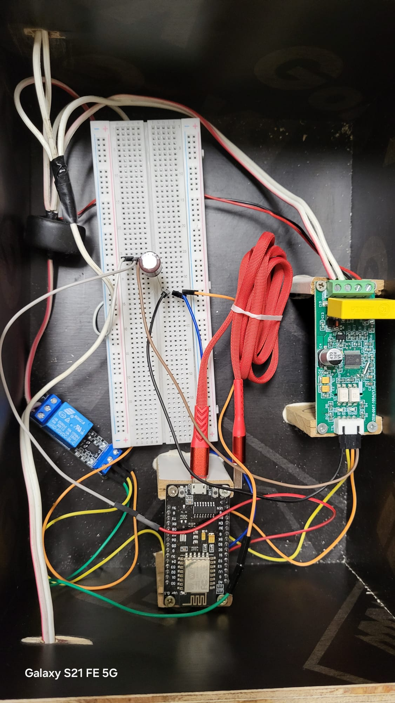
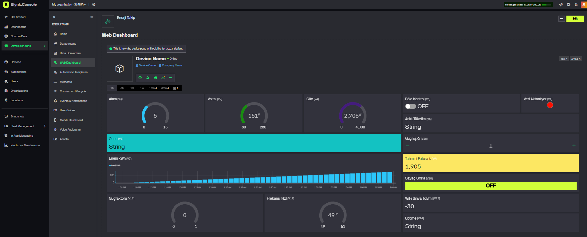
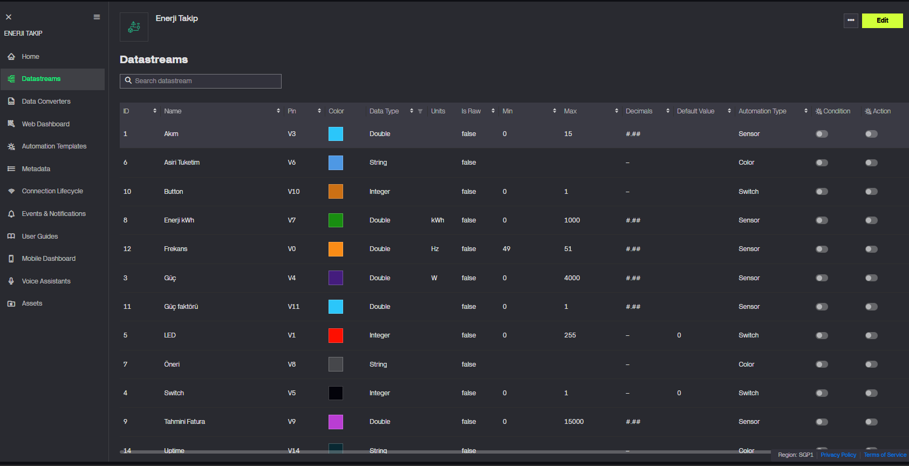

<div align="center">

# ⚡ ESP8266 IoT Energy Monitor

**Real-time energy monitoring & control system built from scratch**

[](https://enerjitakipsistemi.netlify.app)
[](https://github.com/nurbeyzayilmaz/esp8266-iot-energy-monitor)
[](firmware/)
[](web-dashboard/)
[](https://supabase.com)

*A personal IoT project that measures, monitors, and controls household electrical consumption in real-time.*

</div>

---

## 📖 Overview

This project is a complete, end-to-end IoT energy monitoring system that I designed and built entirely from scratch. It reads electrical measurements from a **PZEM-004T v3.0** power sensor via **Modbus RTU** protocol, streams data to **Supabase** (PostgreSQL), and displays it on a **Next.js** real-time web dashboard. The system also allows remote relay control to cut power automatically when consumption exceeds a threshold.

> **Status:** Actively running 24/7 on a physical hardware prototype in a custom wooden enclosure.

---

## 🏗️ System Architecture

```
┌─────────────────────────────────────────────────────────────────┐
│                        220V AC LINE                             │
│   [Plug] ──────── [PZEM-004T Clamp] ──────── [Load Device]    │
│                         │                          ↑            │
│                    (Modbus RTU)               [Relay NC]        │
│                    UART/Serial                     │            │
└──────────────────────────────────────────────────────────────────┘
                           │                         │
                    ┌──────▼──────┐                  │
                    │  ESP8266    │──── D1 ──────────┘
                    │  NodeMCU   │     (Relay Control - Active LOW)
                    │            │
                    │  D5 → RX   │  SoftwareSerial
                    │  D6 → TX   │  @ 9600 baud
                    └──────┬──────┘
                           │ HTTPS / REST API
                           │ (every 2 seconds)
                    ┌──────▼──────────────────┐
                    │     Supabase            │
                    │  ┌─────────────────┐   │
                    │  │ readings table  │   │
                    │  │ commands table  │   │
                    │  │ settings table  │   │
                    │  │ alerts table    │   │
                    │  └─────────────────┘   │
                    └──────┬──────────────────┘
                           │ Realtime WebSocket
                           │ + REST polling
                    ┌──────▼──────────────────┐
                    │   Next.js Dashboard     │
                    │   (Netlify deployed)    │
                    │   Recharts + TailwindCSS│
                    └─────────────────────────┘
```

---

## 🔩 Hardware Components

| Component | Model | Purpose |
|-----------|-------|---------|
| **Microcontroller** | ESP8266 NodeMCU v1.0 | WiFi + firmware execution |
| **Power Sensor** | PZEM-004T v3.0 | Voltage / current / power / energy measurement |
| **Relay Module** | SRD-05VDC-SL-C (Active-LOW) | Remote circuit breaker control |
| **Enclosure** | Custom wooden box | Physical housing |
| **Power Supply** | 5V USB adapter | NodeMCU power |
| **Wiring** | 220V AC rated cables | Main circuit wiring |

---

## 📌 Pin Connections

| ESP8266 Pin | Connected To | Purpose |
|-------------|--------------|---------|
| `D5` | PZEM-004T TX | SoftwareSerial RX |
| `D6` | PZEM-004T RX | SoftwareSerial TX |
| `D1` | Relay IN | Relay control (Active-LOW) |
| `D2` | Button (GND) | Physical relay toggle |
| `3V3 / GND` | PZEM VCC/GND | Sensor power |

> ⚠️ **Relay wiring:** Output cable must be on the **NC (Normally Closed)** terminal so default state = current flowing.

---

## ✨ Features

### Firmware (C++ / Arduino)
- [x] **Modbus RTU** communication with PZEM-004T over SoftwareSerial
- [x] Reads: voltage, current, power (W), energy (kWh), power factor, frequency
- [x] **Exponential moving average** filter (α=0.3) for stable readings
- [x] Power offset correction for cable/measurement losses
- [x] **Over-consumption alert** → auto-writes to Supabase `alerts` table
- [x] Remote relay control via `commands` table polling (2s interval)
- [x] Physical button debounce with `millis()` (no `delay()`)
- [x] Dynamic threshold & price settings fetched from Supabase (60s refresh)
- [x] WiFi auto-reconnect with restart fallback (5 retries)
- [x] Heap memory watchdog (restarts if < 12KB free)
- [x] 3-second boot safety delay before accepting relay commands

### Web Dashboard (Next.js + Supabase)
- [x] **Supabase Realtime** WebSocket for instant updates
- [x] Polling fallback with Page Visibility API support
- [x] Real-time power chart (Recharts) — 15min / 1h / 6h / 24h ranges
- [x] 8 metric cards: voltage, current, power, energy, PF, frequency, max power, estimated bill
- [x] Remote relay toggle with optimistic UI update
- [x] Over-threshold warning banner with pulse animation
- [x] Energy counter reset & WiFi reset commands
- [x] Smart advisory system (5 tiers: idle → efficient → normal → high → critical)
- [x] Data freshness indicator (online / stale / offline)
- [x] Configurable settings: threshold, unit price, refresh interval, password

---

## 📸 Screenshots

### 🔩 Physical Prototype

<p align="center">
  
  &nbsp;
  
</p>

<p align="center"><i>Custom wooden enclosure housing ESP8266 NodeMCU, PZEM-004T v3.0 sensor, and Active-LOW relay module with full 220V AC wiring</i></p>

---

### 📊 Web Dashboard



*Real-time readings: voltage (151V), power (2706W), energy chart, estimated bill (₺1,905), relay control, and advisory system*

---

### ⚙️ Datastreams Configuration



*14 virtual datastreams: current, voltage, power, energy (kWh), frequency, power factor, relay switch, LED, button, advisory message, estimated bill, WiFi RSSI, uptime*

---

## 🗂️ Repository Structure

```
esp8266-iot-energy-monitor/
│
├── firmware/
│   └── enerji-takip-esp8266.ino   # ESP8266 firmware (C++/Arduino)
│                                   # Modbus RTU + Supabase REST API
│
├── web-dashboard/
│   ├── app/
│   │   ├── page.tsx               # Login page
│   │   ├── layout.tsx             # Root layout
│   │   ├── providers.tsx          # React context providers
│   │   └── dashboard/
│   │       └── page.tsx           # Main real-time dashboard
│   ├── lib/
│   │   ├── supabase.ts            # Supabase client + data fetchers
│   │   └── types.ts               # TypeScript type definitions
│   └── .env.example               # Environment variables template
│
└── docs/
    ├── prototype-overview.jpeg    # Hardware photo — full view
    ├── prototype-closeup.jpeg     # Hardware photo — close-up
    ├── blynk-dashboard.png        # Web dashboard screenshot
    └── blynk-datastreams.png      # Datastreams config screenshot
```

---

## 🚀 Getting Started

### Firmware Setup

1. **Install Arduino IDE** and add ESP8266 board support
2. **Install libraries** via Library Manager:
   - `PZEM004Tv30` by Maxz
   - `ArduinoJson` by Benoit Blanchon
   - `ESP8266WiFi`, `ESP8266HTTPClient` (built-in with ESP8266 core)
3. **Clone this repo** and open `firmware/enerji-takip-esp8266.ino`
4. **Edit credentials** at the top of the file:
   ```cpp
   const char* WIFI_SSID = "YOUR_WIFI_SSID";
   const char* WIFI_PASS = "YOUR_WIFI_PASSWORD";
   const char* SUPABASE_URL = "https://YOUR_PROJECT_ID.supabase.co";
   const char* SUPABASE_KEY = "YOUR_SUPABASE_ANON_KEY";
   ```
5. **Flash** to ESP8266 NodeMCU (115200 baud)

### Web Dashboard Setup

```bash
# Clone and navigate to web directory
cd web-dashboard

# Install dependencies
npm install

# Copy and configure environment
cp .env.example .env.local
# → Edit .env.local with your Supabase credentials

# Run development server
npm run dev
```

### Supabase Database Schema

Create the following tables in your Supabase project:

```sql
-- Sensor readings (every 2 seconds)
CREATE TABLE readings (
  id              BIGSERIAL PRIMARY KEY,
  voltage         FLOAT,
  current_a       FLOAT,
  power           FLOAT,
  energy          FLOAT,
  power_factor    FLOAT,
  frequency       FLOAT,
  rssi            INT,
  uptime_seconds  BIGINT,
  max_power       FLOAT,
  created_at      TIMESTAMPTZ DEFAULT NOW()
);

-- Remote commands from dashboard → ESP8266
CREATE TABLE commands (
  id         BIGSERIAL PRIMARY KEY,
  command    TEXT NOT NULL,  -- 'relay_on' | 'relay_off' | 'energy_reset' | 'wifi_reset'
  executed   BOOLEAN DEFAULT FALSE,
  created_at TIMESTAMPTZ DEFAULT NOW()
);

-- Configurable settings
CREATE TABLE settings (
  key        TEXT PRIMARY KEY,
  value      TEXT NOT NULL,
  updated_at TIMESTAMPTZ DEFAULT NOW()
);

-- Over-consumption events
CREATE TABLE alerts (
  id          BIGSERIAL PRIMARY KEY,
  message     TEXT,
  power_value FLOAT,
  created_at  TIMESTAMPTZ DEFAULT NOW()
);
```

---

## 🛠️ Tech Stack

| Layer | Technology | Version |
|-------|-----------|---------|
| **Microcontroller** | ESP8266 / Arduino C++ | ESP8266 Core 3.x |
| **Sensor Protocol** | Modbus RTU (PZEM004Tv30 lib) | v3.0 |
| **Cloud Database** | Supabase (PostgreSQL) | - |
| **Realtime** | Supabase Realtime WebSocket | - |
| **Frontend** | Next.js + React | 15.x |
| **Styling** | TailwindCSS | 3.x |
| **Charts** | Recharts | 2.x |
| **Icons** | Lucide React | - |
| **Deployment** | Netlify | - |

---

## 👤 Author

**Beyza Nur Yılmaz**
Electrical & Electronics Engineering, 3rd Year
İnönü Üniversitesi

[](https://www.linkedin.com/in/nur-beyza-yilmaz/)
[](https://github.com/nurbeyzayilmaz)
[](https://enerjitakipsistemi.netlify.app)

---

<div align="center">
<i>Built with real hardware. Running 24/7. Measured in kilowatt-hours.</i>
</div>